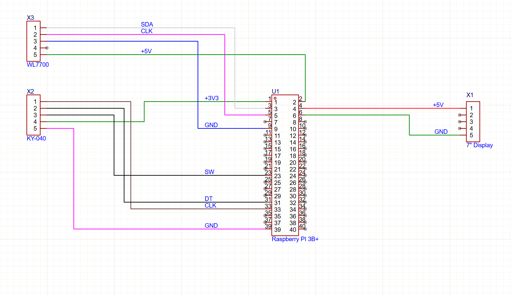
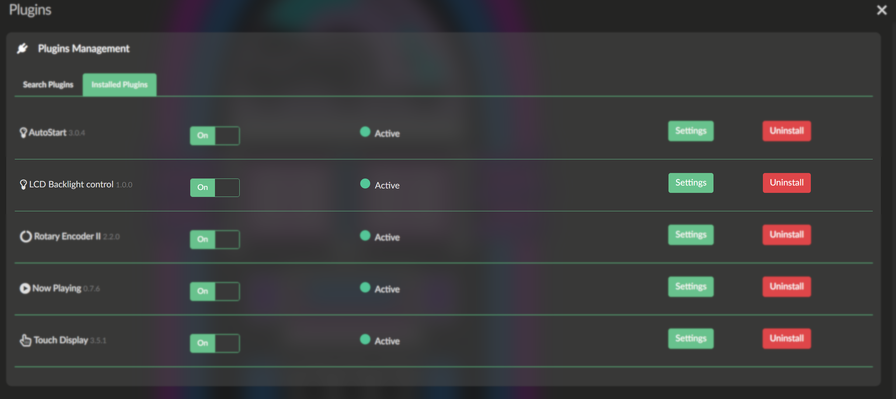
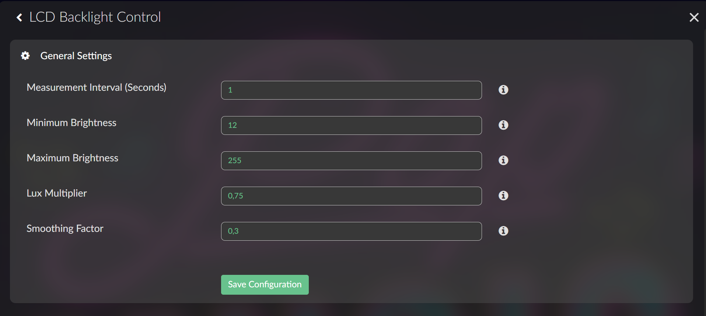

#    LCD Backlight Control Plugin for Volumio 3


A Volumio 3 plugin for automatic LCD backlight control based on ambient light levels using the VEML7700 light sensor, with intelligent brightness boost during music playback.

## Overview

This plugin automatically adjusts the brightness of LCD displays with backlight control based on ambient light conditions. It uses the VEML7700 ambient light sensor to measure lux levels and dynamically adjusts the display brightness for optimal viewing in any lighting environment. Additionally, it can increase brightness during music playback for better visibility.

## Features

- **Automatic Brightness Control**: Adjusts LCD backlight based on ambient light readings from VEML7700 sensor
- **Playback-Aware Brightness Boost**: Automatically increases brightness during music playback and maintains it for a configurable duration after playback stops
- **Configurable Brightness Range**: Set minimum and maximum brightness levels to suit your preferences
- **Smooth Transitions**: Adjustable smoothing factor for gradual brightness changes
- **Customizable Sensor Calibration**: Fine-tune the sensor response with a lux multiplier
- **Flexible Measurement Interval**: Configure how often the sensor reads ambient light (0.1 - 10 seconds)
- **Real-time Playback Detection**: Monitors Volumio's playback state via API
- **Multi-language Support**: Includes English and Slovak translations (extensible to all Volumio-supported languages)

## ð§ Hardware Components

| Component | Model/Type | Description |
|-----------|------------|-------------|
| **Main Unit** | Raspberry Pi 3B+ | Control unit |
| **Display** | 7" LCD DPI (OFI009) | Touch display connected via DPI interface |
| **Encoder** | KY-040 | Rotary encoder for volume control |
| **Light Sensor** | VEML7700 (BH-014PA) | 16-bit I2C ambient light sensor |

## ð Wiring Diagram

### I2C Bus (VEML7700 Sensor)


```
Raspberry Pi 3B+          VEML7700 (WL7700)
âââââââââââââââââ         ââââââââââââââââââ
Pin 1  (3.3V)    ââââââââ Pin 5 (+3.3V)
Pin 3  (GPIO 2)  ââââââââ Pin 2 (SDA)
Pin 5  (GPIO 3)  ââââââââ Pin 1 (SCL)
Pin 6  (GND)     ââââââââ Pin 4 (GND)
```

### GPIO Pinout Reference

```
+-----+-----+---------+------+---+---Pi 3B+-+---+------+---------+-----+-----+
| BCM | wPi |   Name  | Mode | V | Physical | V | Mode | Name    | wPi | BCM |
+-----+-----+---------+------+---+----++----+---+------+---------+-----+-----+
|     |     |    3.3v |      |   |  1 || 2  |   |      | 5v      |     |     |
|   2 |   8 |   SDA.1 | ALT0 | 1 |  3 || 4  |   |      | 5v      |     |     |
|   3 |   9 |   SCL.1 | ALT0 | 1 |  5 || 6  |   |      | 0v      |     |     |
|   4 |   7 | GPIO. 7 |   IN | 1 |  7 || 8  | 1 | IN   | TxD     |  15 |  14 |
+-----+-----+---------+------+---+----++----+---+------+---------+-----+-----+
```

### Rotary Encoder (KY-040)

- **CLK**: GPIO pin (BCM numbering from `gpio readall`)
- **DT**: GPIO pin (BCM numbering)
- **SW**: GPIO pin (button)
- **+**: 3.3V
- **GND**: Ground

> **Note**: Configure encoder pins in Volumio's Rotary Encoder plugin using **BCM** pin numbers.<br>
>           **No KY-040 rotary encoder connection is needed for the plugin to function properly.**
### Display Connection

- **Power**: +5V and GND from connector X1
- **DPI Signals**: Connected according to `/boot/config.txt` DPI configuration


## Installation

1. Manual Plugin Installation
   - download lcd_backlight.zip from download section , or from github
   - unzip downladed zip file, to the lcd_backlight directory and run following comands from shell <br>
     `cd ../lcd_backlight` <br>
     `sudo sudo chmod +x install.sh`<br>
     `sudo ./install.sh`<br>
     `volumio plugin refresh`<br>
   - The plugin will appear among the installed plugins.


If it does not, it is necessary to delete the file /data/configuration/plugins.json and restart Volumio using the command  volumio vrestart

2. Install the plugin through the Volumio web interface:
   - Navigate to **Plugins** â **Install Plugins**
   - Search for "LCD Backlight Control" or upload the plugin package
   
2.1 The installation script will:
   - Install Python dependencies (`python3-smbus`, `python3-requests`)
   - Copy the Python control script to `/usr/local/bin/`
   - Create configuration directory at `/etc/lcd_backlight/`
   - Install and enable the systemd service
   - Set appropriate permissions

## Configuration

Access the plugin settings through the Volumio web interface under **Plugins** â **LCD Backlight Control** button **Settings** .


### Available Settings

#### Measurement Interval
- **Range**: 0.1 - 10 seconds
- **Default**: 1 second
- **Description**: Time between light sensor readings. Lower values provide more responsive brightness changes but may increase CPU usage.

#### Minimum Brightness
- **Range**: 0 - 255
- **Default**: 12
- **Description**: The lowest brightness level the display will reach. Prevents the screen from becoming too dark or turning off completely.

#### Maximum Brightness
- **Range**: 0 - 255
- **Default**: 255
- **Description**: The highest brightness level the display will reach. Can be reduced to save power or limit maximum brightness.

#### Lux Multiplier
- **Range**: 0.01 - 10
- **Default**: 0.75
- **Description**: Calibration multiplier for the VEML7700 sensor. Increase for brighter response to ambient light, decrease for darker response. Use this to fine-tune the sensor's sensitivity to your environment.

#### Smoothing Factor
- **Range**: 0.0 - 1.0
- **Default**: 0.3
- **Description**: Controls how quickly brightness transitions occur. Lower values create slower, smoother transitions. Higher values make brightness changes more immediate and responsive.

#### Playback Brightness Boost
- **Range**: 0 - 255
- **Default**: 0
- **Description**: Additional brightness added to the calculated brightness level during music playback. This ensures better screen visibility when actively using the player. Set to 0 to disable this feature.

#### Boost Duration After Playback
- **Range**: 0 - 300 seconds
- **Default**: 30 seconds
- **Description**: How long to maintain the brightness boost after playback stops. This provides a grace period before the brightness returns to ambient-based levels. Useful to keep the screen bright while browsing between tracks.

## How It Works

### Ambient Light Control
1. The plugin reads ambient light levels from the VEML7700 sensor at regular intervals
2. The lux reading is multiplied by the configured lux multiplier for calibration
3. The brightness value is calculated using a logarithmic curve and constrained within the min/max range

### Playback Boost System
1. The plugin monitors Volumio's playback state via its REST API (http://localhost:3000/api/v1/getState)
2. When playback status changes to "play":
   - The configured brightness boost is added to the ambient-calculated brightness
   - The boost remains active throughout playback
3. When playback stops:
   - A countdown timer starts for the configured boost duration
   - The boost remains active during this period
   - After the timer expires, brightness returns to ambient-only control
4. A smoothing algorithm gradually adjusts the backlight to prevent abrupt changes

### Final Brightness Calculation
```
Final Brightness = min(MAX_BACKLIGHT, Ambient_Brightness + Playback_Boost)
```

## Technical Details

### File Structure

```
lcd_backlight/
âââ index.js                    # Main plugin controller
âââ backlight_control.py        # Python script for hardware control
âââ lcd_backlight.service       # Systemd service file
âââ install.sh                  # Installation script
âââ uninstall.sh               # Uninstallation script
âââ UIConfig.json              # Web UI configuration
âââ package.json               # Plugin metadata
âââ i18n/                      # Translations
    âââ strings_en.json        # English strings
    âââ strings_sk.json        # Slovak strings
/usr/local/bin/
âââ backlight_control.py        # Main Python skript
```

### Configuration Files

The plugin stores configuration in two locations:

1. **Persistent Config**: `/data/plugins/system_hardware/lcd_backlight/config.json`
   - Stores all plugin settings
   - Managed by Volumio's configuration system

2. **Runtime Config**: `/etc/lcd_backlight/`
   - Individual files for each setting (e.g., `lcd_enabled`, `lcd_int_time`, `lcd_playback_boost`)
   - Read by the Python control script
   - Allows real-time configuration updates without restarting the service

### Service Management

The plugin uses a systemd service (`lcd_backlight.service`) that:
- Runs the Python control script as a daemon
- Starts automatically on boot when the plugin is enabled
- Restarts automatically on failure
- Logs to systemd journal
- Monitors Volumio API for playback state changes

#### Log Output Example

For debug purpose, uncomment lines 358-360 in backlight_control.py:
```python
# Uncomment for debug
# if success:
#     boost_indicator = " [BOOST]" if self.playback_boost_active else ""
#     print(f"[{time.strftime('%H:%M:%S')}] Lux: {lux:6.1f} | Brightness: {self.current_brightness:3d}/{self.max_backlight}{boost_indicator}")
```

Console output will be:
```
[12:34:56] Lux:  245.3 | Brightness: 145/255
[12:34:57] Lux:  248.1 | Brightness: 147/255
[12:35:12] Playback started - activating boost (+50)
[12:35:13] Lux:  251.7 | Brightness: 199/255 [BOOST]
[12:37:45] Playback stopped - boost active for 30s
[12:38:15] Boost period expired - deactivating
[12:38:16] Lux:  249.2 | Brightness: 148/255
```

### API Integration

The plugin queries the Volumio API endpoint:
```
GET http://localhost:3000/api/v1/getState
```

Response format:
```json
{
  "status": "play|pause|stop",
  "title": "Song Title",
  "artist": "Artist Name",
  ...
}
```

## Troubleshooting

### Plugin doesn't start
- Check if the VEML7700 sensor is properly connected via I²C
- Verify I²C is enabled on your system (`sudo i2cdetect -y 1`)
- Check systemd service status: `systemctl status lcd_backlight.service`
- Review logs: `journalctl -u lcd_backlight.service -f`

### Brightness not changing
- Verify the backlight device exists: `ls /sys/class/backlight/`
- Check configuration files in `/etc/lcd_backlight/`
- Ensure `lcd_enabled` is set to `1`
- Test sensor readings manually

### Playback boost not working
- Verify Volumio API is accessible: `curl http://localhost:3000/api/v1/getState`
- Check if playback_boost is set to a value greater than 0
- Review service logs for API connection errors
- Ensure python3-requests is installed

### Brightness changes too quickly/slowly
- Adjust the **Smoothing Factor** setting
- Lower values = slower transitions
- Higher values = faster transitions

### Display too bright/dark
- Adjust the **Lux Multiplier** to calibrate sensor response
- Modify **Minimum Brightness** and **Maximum Brightness** ranges
- Fine-tune **Playback Brightness Boost** value
- Test in different lighting conditions

## Uninstallation

The plugin can be uninstalled through the Volumio web interface. The uninstallation process will:
- Stop and disable the systemd service
- Remove the service file
- Remove the Python control script
- Clean up configuration files

## Version

**Current Version**: 1.1.0
 - added boost brightness durring playback
 - instal/uninstall script fix


## License

This project is open-source and available under the ISC License. You may use and modify it freely. You may use the program as is at your own risk, no updates or modifications to the code will be made, no planed, and no warranties or claims for damages will be made in connection with any use of this code.

## Author

lubomirkarlik60@gmail.com

## Support

For issues, questions, or contributions, please visit the plugin's repository or contact through the e-mail.

---

**Note**: This plugin requires appropriate hardware (VEML7700 sensor and compatible LCD display) and may need system-level permissions to access I²C, backlight control interfaces, and Volumio API.
