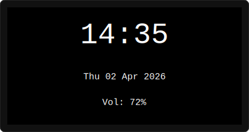
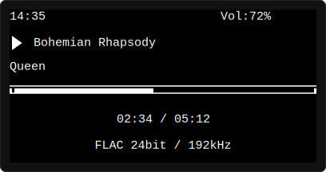
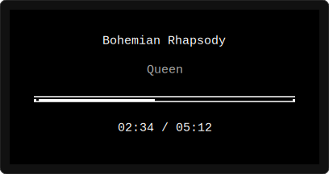
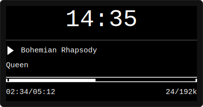

# OLED SSD1309 Display Plugin for Volumio – v1.7.27

> **⚠️ Disclaimer**
>
> This plugin was developed with the assistance of AI (Claude by Anthropic). While it has been tested on real hardware and is functional, it is provided as-is without warranty. Use at your own risk. The author assumes no responsibility for any damage to your hardware, software, or data. Always back up your Volumio configuration before installing third-party plugins.

Displays playback information on a 128×64 SSD1309 I2C OLED connected to a Raspberry Pi running Volumio.

---

## Features

- **Now Playing:** scrolling track title and artist name
- **Clock:** current time (12h or 24h format, configurable)
- **Progress bar:** visual progress + elapsed / total time
- **Audio format:** codec type, bit depth, sample rate, or bitrate for webradio
- **Volume:** current volume percentage + full-screen overlay on change
- **Idle screen:** large clock with date and volume, auto-dim after configurable timeout
- **Screensaver:** bouncing clock, bouncing dot, or drifting Volumio text after extended idle
- **Splash screen:** "Volumio" with animated dots until Volumio is ready
- **Playback layouts:** three selectable styles (Classic, Minimal, Clock Focus)
- **Zero MPD contact:** all data comes from Volumio's socket API — no playback interference

### Screen Previews

**Idle Screen**



**Playback — Classic Layout**



**Playback — Minimal Layout**



**Playback — Clock Focus Layout**



---

## Changelog

### v1.7.27

**Rollback / cleanup:**

1. **Bluetooth no-metadata screens removed (v1.7.24 — v1.7.26).** These were added to handle a Volumio Bluetooth-plugin issue where playback state isn't broadcast over the socket.io `pushState` channel. The Volumio team has been notified and is investigating; their fix will restore normal `pushState` behavior for Bluetooth, after which the regular playback layouts will render BT correctly with no special-case code needed in this plugin. The v1.7.26 polling backstop (which made the Bluetooth screens actually appear by emitting `getState` every 3 seconds) introduced race conditions on track changes and seek-counter jitter, and represented behavior foreign to the Volumio plugin ecosystem — none of that was worth keeping for a workaround that the upstream fix will obsolete. The three layout-specific Bluetooth render methods (Classic/Clock Focus/Minimal) are preserved outside the codebase in case they're needed for a different purpose later.
2. **Retained:** the `'bt'` entry in `SKIP_TRACK_TYPES` (added in v1.7.24). Once Volumio starts broadcasting BT state correctly, `trackType: 'bt'` will arrive as part of normal pushState events. This entry prevents the codec-prefix logic from labeling the audio-info line "BT 24bit / 96kHz" — `'bt'` is a transport indicator, not a codec name, and skipping it produces a cleaner display.

### v1.7.26

Removed in v1.7.27. State-polling backstop for the Bluetooth-screen feature. See v1.7.27 changelog for rationale.

### v1.7.25

Removed in v1.7.27. Layout-specific Bluetooth screen variants (Classic/Clock Focus/Minimal). See v1.7.27 changelog for rationale.

### v1.7.24

Removed in v1.7.27 (except for the `'bt'` skip-list entry, which is retained). Initial Bluetooth-no-metadata screen. See v1.7.27 changelog for rationale.

### v1.7.23

**Bug fix:**

1. **"FLAC PCM" no longer appears momentarily after track changes.** When Volumio's `pushState` populates `trackType` (the codec name) before `bitdepth` / `samplerate` / `bitrate` have been resolved by the player backend — a window of typically <100ms but occasionally longer for gapless transitions or slow NAS reads — the audio-info formatter previously combined the codec prefix with its "PCM" placeholder fallback, producing nonsense strings like `"FLAC PCM"`, `"MP3 PCM"`, or `"DSD PCM"`. The formatter now shows the codec alone during the transient (`"FLAC"`), then upgrades to the full string (`"FLAC 24bit / 96kHz"`) on the next state update. The `"PCM"` placeholder is still used as a last-resort fallback when nothing is known about the stream. Same fix applied to the compact variant used by the time-sharing playback layout.

### v1.7.22

**Documentation only:**

1. **Install instructions clarify the store-vs-source distinction and add `build-essential` as a prerequisite for source installs.** When installing from source via `volumio plugin install`, the Volumio plugin manager runs `npm install` before `install.sh`, which means the build toolchain has to already be present on the Pi.  On a fresh Volumio image (or right after a factory reset), `build-essential` is not installed by default and `i2c-bus`'s native compile step fails with `not found: make`.  The README now lists `build-essential` as a one-time prereq for source installs and explains that store users (once the plugin is published) don't need it because the store delivers a pre-built archive with the native binary already compiled.  The "Alternative: manual install" section also notes that `install.sh` self-installs `build-essential` before `npm install`, so that path doesn't need the prereq either.

### v1.7.21

**Documentation only:**

1. **Install instructions updated** to recommend `volumio plugin install`.  This is Volumio's own plugin manager command — invoked from inside the extracted source folder, it copies files into place, runs `install.sh`, and registers the plugin.  No manual folder creation and no manual file copying.  A reboot is still required after install for the I2C baudrate change in `/boot/userconfig.txt` to take effect, but the reason is now documented honestly.  The previous manual-extraction method is kept as a fallback section for older Volumio versions where the CLI may not work.

### v1.7.20

**Bug fix (corrects v1.7.19):**

1. **Display now reliably powers off on system reboot and shutdown.** v1.7.19 attempted to fix this by adding `onReboot` and `onShutdown` lifecycle methods, but those names don't match what Volumio actually looks up. The Volumio log lines `PLUGIN onReboot : <name>` and `PLUGIN onShutdown : <name>` are human-readable shorthand — the real method names checked on the plugin prototype are `onVolumioReboot` and `onVolumioShutdown` (see `volumio3-backend/app/pluginmanager.js` lines 636 and 682). v1.7.20 uses the correct names. The shared `_systemPowerOff(reason)` helper clears the framebuffer, flushes, and powers off the display synchronously inside the hook, before Volumio invokes `systemctl reboot`/`poweroff`. The previous SIGTERM and socket-event handlers are retained as defensive backups.

### v1.7.19

Initial attempt at the reboot/shutdown power-off fix. Used the wrong method names (`onReboot`/`onShutdown`) — Volumio silently ignored them. **Superseded by v1.7.20.**

### v1.7.18

**Bug fix:**

1. **Ghost state detection no longer misclassifies music-service plugins during their loading window.** Music-source plugins (Tidal, Spotify, internet radio plugins like 80s80s/90s90s, etc.) set the `service` field immediately when playback starts but only populate `title`, `artist`, and `duration` after their metadata API call returns. The previous ghost-state check matched on `status=play` + empty metadata + `duration=0` alone, which was the same shape these plugins briefly produce during loading — causing the OLED to fall back to the idle screen instead of showing the expected playback screen. The check now also requires `service` to be empty, so only genuine ghost states (left behind by AirPlay or Bluetooth disconnect, where no service field is set) are caught.

### v1.7.17

**Improvement:**

1. **Install script cleanup on failure.**  `install.sh` now removes the plugin folder if installation fails (e.g. native addon compilation error), so users are not left with a broken plugin entry in the Volumio plugin list.  Implemented as an `EXIT` trap that fires only on non-zero exit codes, with a path-shape safety check (`*/plugins/*`) to prevent accidental removal.  Required for Volumio plugin store compliance.

### v1.7.16

**Improvement:**

1. **Configurable date format.**  New dropdown in the Display Options section with four formats: "Day + Month name" (Thu 02 Apr 2026, uses localized names), "DD.MM.YYYY" (02.04.2026), "MM/DD/YYYY" (04/02/2026), and "YYYY-MM-DD" (2026-04-02).  The dropdown labels are translated in all 7 languages.

### v1.7.15

**New features:**

1. **Extended character set.**  Added Unicode support for Central European languages.  Lowercase accented characters with marks above (ć, ń, ś, ź, č, ř, š, ž, ä, ö, ü, é, ñ, etc.) display correctly using accent overlays.  Hand-designed glyphs for special shapes (ł, ż, ď, ť, ı).  Uppercase accented characters and characters with marks below the baseline (ą, ę) are mapped to their unaccented base letters — a pragmatic choice since the 5×7 pixel font has no room for accents above uppercase or tails below the baseline.

2. **Localized date display.**  The idle screen date now shows day and month names in the user's language (e.g. "Do 02 Apr 2026" for German, "Czw 02 Kwi 2026" for Polish).  The date format order follows the language convention.  Language data is loaded from i18n string files (EN, DE, FR, PL, ES, IT, NL) based on Volumio's GUI language setting.

3. **Multilingual section labels.**  The plugin configuration page section headers (Hardware / Display) are translated via Volumio's i18n system.  Content labels and descriptions remain in English for compatibility.

### v1.7.14

**Improvements:**

1. **Colon blink uses frame counting.**  Replaced the timestamp-based toggle with a simple frame counter (`_colonFrameCount`), eliminating the periodic hiccup that occurred every ~5th blink due to accumulated setTimeout drift.  The toggle interval is calculated once at start: `Math.round(1000 / renderInterval)` frames.

2. **Refresh interval is now a dropdown.**  Changed from a freeform number input (200–2000ms) to four preset options: 200ms (fast), 250ms (smooth), 500ms (default), 1000ms (power save).  All four divide evenly into 1000ms, guaranteeing a perfectly even colon blink regardless of the selected interval.

3. **Screensaver bounce randomised.**  Starting position and direction are now randomised on each activation.  Each edge collision adds ±10% speed variation via `_nudgeBounce()`, so the path gradually evolves and never traces the same route twice.  Speed is clamped to 0.5–1.8 to prevent stalling or excessive speed.

### v1.7.13

**Improvement:**

1. **I2C fast mode (400kHz) set during install.**  The install script now adds `dtparam=i2c_arm_baudrate=400000` to `/boot/userconfig.txt` if no baudrate is already configured.  At the default 100kHz, flushing the 1024-byte framebuffer takes ~100ms per frame, causing the actual render interval to drift to ~600ms and producing visibly uneven colon blink and position counter updates.  At 400kHz (within the SSD1309's fast mode spec), flush drops to ~25ms, keeping the render loop close to the configured 500ms interval.  The setting is skipped if a baudrate is already present, and a note is displayed about potential compatibility with other 100kHz-only I2C devices.

### v1.7.12

**Refinements:**

1. **Removed Large Title layout.**  Dropped from the dropdown — without a larger font the title wasn't visually distinct enough from the Classic layout to justify a separate option.

2. **Classic layout: thinner progress bar.**  Reduced from 5px to 3px height (matching the Minimal layout) for a cleaner appearance and more visual breathing room.

3. **Compact audio info formatter.**  New `_formatAudioInfoCompact()` produces shortened output for layouts that share a line with time: "FLAC 24/192k" instead of "FLAC 24bit / 192kHz", "128Kbps" instead of "128 Kbps".  Prevents the text overlap that occurred on the Clock Focus layout.

### v1.7.11

**New feature:**

1. **Configurable playback layouts.**  Four playback screen layouts are now available, selectable via a "Playback Layout" dropdown in the plugin settings:
   - **Classic:** The original layout — status bar with clock + volume, play icon + title, artist, progress bar, centered time, centered audio info.
   - **Large Title:** Title positioned prominently at the top with play icon, artist below, progress bar, time and audio info on one line, volume at the bottom.
   - **Minimal:** Centered title and artist, thin progress bar, centered time.  No clock, volume, or audio info — maximum visual calm.
   - **Clock Focus:** Large clock at the top (like the idle screen), thin separator, compact title + artist, progress bar, time and audio info.  Ideal for bedside use.
   
   Each layout method is self-contained.  Shared helpers `_calcProgress()` and `_drawProgressBar()` extract common logic to reduce duplication.  The default is "Classic" so existing users see no change.

2. **Author and repository.**  package.json now lists Zhapox as author and includes the GitHub repository URL.

### v1.7.10

**New feature:**

1. **Codec type indicator on audio info row.**  Volumio's `trackType` field is now displayed as an uppercase prefix on the audio info row (e.g. "FLAC 24bit / 192kHz", "MP3 128 Kbps", "DSF DSD64").  Transport/service types (airplay, webradio, spotify, tidal, qobuz, upnp, bluetooth) are excluded via a skip list — only actual codec names are shown.  If the combined string exceeds the display width (21 chars), the codec prefix is silently dropped.  New codecs that Volumio adds in the future will automatically appear without a code change.

### v1.7.9

**Improvements:**

1. **Replaced deprecated kew with native Promises.**  All lifecycle methods (`onVolumioStart`, `onStart`, `onStop`, `getUIConfig`, `saveConfig`) now use native `Promise` instead of the deprecated kew library.  Volumio's `i18nJson()` return is wrapped via `Promise.resolve()` for compatibility with both kew and native Promise returns from the platform.  The kew `require` is removed entirely.

2. **Webradio bitrate display.**  When playing webradio streams, the audio info row now shows the stream bitrate (e.g. "128 Kbps") instead of the generic "PCM" fallback.  The `bitrate` field from Volumio's `pushState` is captured and used when `bitdepth` and `samplerate` are both unavailable, which is typical for internet radio streams.

### v1.7.8

**Improvements:**

1. **Install script auto-configures detected I2C address.**  After scanning the I2C bus, if the display is found at an address other than the default 0x3C (e.g. 0x3D), the installer writes the detected address directly to the Volumio-managed config file in v-conf format.  No manual configuration needed for non-default addresses.

2. **Uninstall script with proper cleanup.**  The uninstall script now performs three actions: (1) sends DISPLAY_OFF command to power off the display via i2cset, (2) removes `node_modules/` and `package-lock.json` (~5MB of compiled native addon), and (3) removes the Volumio-managed config directory.  I2C system configuration is left intact as other devices may depend on it.

### v1.7.7

**Bug fix:**

1. **Config persistence — v-conf format compatibility.**  v-conf's `loadFile()` silently ignores plain JSON values (e.g. `"idle_contrast": 10`).  It requires its own wrapped format: `{"type":"number","value":10}`.  Previous versions wrote plain JSON, which was correct on disk but invisible to v-conf on reload, causing the UI to show defaults.  `_persistToManagedConfig` now wraps all values in v-conf format using a type map before writing.  The bundled `config.json` is also converted to v-conf format so the initial copy Volumio makes is immediately compatible.

### v1.7.6

**Bug fix:**

1. **Config persistence fix (final).**  Root cause fully identified: v-conf's `set()` triggers a deferred auto-save that fires after our synchronous `writeFileSync`, overwriting the managed config file with stale values.  The fix eliminates `config.set()` from `saveConfig` entirely.  The new flow is: (1) write new values directly to disk via `_persistToManagedConfig(data)`, (2) discard the v-conf instance, (3) reload v-conf from the file we just wrote.  v-conf's deferred save can no longer interfere because the old instance is discarded.  Additionally, any existing v-conf wrapped values (`{"type":"number","value":300}`) in the config file are unwrapped to plain values during the merge step, cleaning up files corrupted by previous versions.

### v1.7.5

**Bug fix:**

1. **Config persistence fix (continued from v1.7.4).**  v-conf's `get()` returns stale values immediately after `set()`, so the v1.7.4 approach of reading back from v-conf to build the config snapshot wrote the old values to disk.  `_persistToManagedConfig` now takes the raw UI data directly, reads the existing managed config file from disk (preserving any keys not in the current save), merges the new values with proper type conversion (parseInt for numbers, bool coercion, object unwrapping for selects), and writes the result.  v-conf is bypassed entirely for disk persistence.

### v1.7.4

**Bug fix:**

1. **Config persistence across reboots.**  Saved settings were reverting to defaults on reboot because v-conf wrote to whichever file it loaded from, which could be the bundled `__dirname/config.json` if Volumio's managed copy wasn't available yet at first boot.  `saveConfig` now explicitly writes a JSON snapshot to the Volumio-managed config path (`/data/configuration/user_interface/oled_display_ssd1309/config.json`), creating the directory if needed.  The loaded config file path is now logged for easier debugging.

2. **Default values shown in settings UI.**  Every configuration item's description now includes the default value in parentheses (e.g. "Display contrast, 0-255 (default: 255)"), so users always know the factory setting after making changes.

### v1.7.3

**Enhancement:**

1. **Splash screen waits for Volumio readiness.**  The splash no longer dismisses after a fixed 2-second countdown.  Instead, the animated "Volumio ..." screen stays visible until the first `pushState` event arrives from Volumio's socket.io, confirming the web UI is ready.  On a cold boot this means 20–40 seconds of splash with cycling dots (visual boot progress) instead of 2 seconds of splash followed by a blank idle screen.  A 30-second safety timeout auto-dismisses if Volumio never responds.  Boot time is logged when the splash ends.

### v1.7.2

**Code quality & polish:**

1. **Screensaver bounce path now covers more of the display.**  Bounce velocity changed from 45° diagonal (1, 1) to off-axis (1.2, 0.8), producing a more varied path that hits different pixels over time.  Improves OLED burn-in protection.

2. **Screensaver clock reposition is now time-based.**  The bouncing clock repositions every ~10 seconds regardless of the configured render interval.  Previously it was frame-count based (20 frames), which varied from ~4s to ~40s depending on settings.

3. **Progress bar borders use fillRect.**  Replaced 6-8 individual setPixel calls per bar with 2 fillRect calls in both the playback and volume overlay screens.  Cleaner code, marginally faster.

4. **Flush address-reset uses pre-allocated buffer.**  The 7-byte command sent on every flush to reset the write pointer is now pre-built in the SSD1309 constructor, eliminating one Buffer.alloc per frame.

5. **Removed dead code.**  Removed unused `_calcVolumeWidth` method and redundant `new Date()` call in the idle screen renderer.

6. **Added coupling comment.**  Documented the centering dependency between `_calcLargeClockWidth` and `_drawLargeClockDigitsAndPercent` for the volume overlay '%' sign.

### v1.7.1

**Bug fixes:**

1. **Colon blink timing drift.**  The idle screen colon blink previously checked `getSeconds() % 2`, which drifted because the 500ms render loop is not synchronised to the system clock. Replaced with an internal toggle timer that flips a boolean every 1000ms, producing a perfectly even cadence regardless of setTimeout jitter.

2. **Ghost state after AirPlay/Bluetooth disconnect.**  When AirPlay disconnects, Volumio can leave the state as 'play' with empty title/artist and zero duration, causing "Unknown Title" with a runaway seek counter.  The render loop now detects this ghost state (play/pause + no title + no artist + duration 0) and treats it as stopped, showing the idle screen instead.

3. **Service indicator removed.**  Volumio's `service` field is too ambiguous for reliable display (e.g. 'mpd' covers USB, NAS, and local files indistinguishably; AirPlay uses varying internal names).  The audio info row reverts to plain bitdepth / samplerate.

### v1.7.0

**New features:**

1. **Splash screen.**  On startup, the display shows "Volumio" with animated loading dots for ~2 seconds before entering the normal render loop.  Confirms the display is working before the socket connects.

2. **Volume overlay.**  When the volume changes, a full-screen overlay shows the volume as a large percentage with a progress bar, visible for a configurable duration (default 2s).  Provides instant visual feedback when using a remote, knob, or the web UI.  The overlay takes priority over all other screens and wakes the display from dim/screensaver.

3. **Screensaver with three-stage idle chain.**  The idle flow is now: **active → dimmed → screensaver**.  After the existing dim timeout, a second configurable timer triggers the screensaver.  Three modes are available via a dropdown in the settings page:
   - **Bouncing Clock:** small "HH:MM" text repositions to a random spot every ~10 seconds.
   - **Bouncing Dot:** a 3×3 pixel dot bounces off screen edges continuously.
   - **Drifting Volumio:** "Volumio" text bounces DVD-logo style.
   - Set to "None" to disable and stay on the dimmed idle screen.
   The display remains at dimmed contrast during the screensaver.  Any activity (playback, volume change) instantly returns to the active screen at full contrast.

### v1.6.0

**Robustness & performance:**

1. **Removed misleading `async` declarations.**  `_startPlugin` and `_stopPlugin` were declared `async` but contained no `await` (everything became synchronous in v1.4+).  They now return explicit `Promise.resolve()` / `Promise.reject()`, making the control flow clear.

2. **Optimised `fillRect()` and `hLine()` in the SSD1309 driver.**  Both now write directly to the page buffer using pre-computed page index and bit masks, instead of calling `setPixel()` per pixel.  `hLine()` computes the page/mask once and loops only over x.  `fillRect()` computes per row instead of per pixel.  ~3-4× faster for large fills.

3. **Pre-allocated flush buffer.**  `flush()` now reuses a single 129-byte buffer instead of allocating 8 new Buffers per frame.  Eliminates ~16 small GC allocations per second.

4. **Cached config values in render loop.**  `contrast`, `idle_contrast`, and `idle_dim_seconds` are now read from v-conf once (on start and save), not parsed on every render frame.

5. **Seek interpolation clamped to duration.**  The interpolated seek value is now capped at `duration × 1000ms`, preventing the time display from showing values like `05:15 / 05:12` when `pushState` updates are delayed.

**Code quality:**

6. **Refactored scroll state.**  Replaced 6 separate variables + 8 if/else branches with per-field state objects (`this._scroll.title`, `this._scroll.artist`).  Makes adding future scrolling fields trivial.

**New features:**

7. **Display rotation (`rotate_180`).**  New config toggle that flips `SEG_REMAP` and `COM_SCAN` in the SSD1309 init sequence.  For enclosures that mount the display upside-down — no rewiring needed.

8. **Colon blink on idle clock (`colon_blink`).**  The large clock's colon toggles on/off every second, giving a visual heartbeat that confirms the display is alive and not frozen.  Configurable — can be disabled in settings.

### v1.5.1

**Layout redesign:**

1. **Playback screen – separator-free layout.**
   Removed all horizontal separator lines for a cleaner look.  Clock and volume moved to a top status bar.  Elapsed time and audio format info (bit depth / sample rate) split into two separate centered rows below the progress bar to prevent overlap on long format strings.

2. **Playback screen – audio info on its own row.**
   Previously time and audio info shared one row, causing overlap with high-resolution formats like `24bit / 192kHz`.  They are now on separate centered lines.

3. **Idle screen – native large clock digits.**
   Replaced the 3× scaled 5×7 font (which produced blocky 15×21 pixel digits) with hand-designed 12×20 pixel glyphs.  Each digit is drawn at native resolution with 4-step rounded corners, producing much smoother curves on 0, 2, 3, 5, 6, 8, 9.

4. **Idle screen – date display.**
   Added a centered date line (e.g. "Tue 31 Mar 2026") below the large clock.  Removed the "- Volumio -" label and separators.

5. **Removed unused code.**
   The `_drawTextScaled` and `_drawCharScaled` methods are no longer needed and have been removed from the renderer.

### v1.5.0

**Bug fixes:**

1. **CRITICAL – SIGTERM / shutdown display-clear crash (from v1.4.0).**
   In v1.4.0 the SSD1309 driver was refactored to use synchronous I2C writes, so `flush()` now returns a plain `{ ok: boolean }` object instead of a Promise.  However, two handlers in `index.js` still called `flush().then(...)`, which threw a TypeError and prevented the display from being cleared on shutdown or reboot.  Both the `SIGTERM` handler and the Volumio `shutdown` socket handler now call `flush()` and `setPower()` directly with no `.then()` chains.

2. **Misleading `await` on synchronous methods.**
   The render loop used `await this.display.setContrast(...)` and `await this.display.flush()`, both of which are synchronous.  While harmless at runtime (await on a non-Promise passes through), this was confusing and implied the methods were async.  The render frame function is now fully synchronous (`_renderFrameSync`), and the `_doRenderFrame` wrapper no longer uses a Promise chain.

3. **Version headers synchronised.**
   All files now consistently identify as v1.5.0.  Previously `package.json` said 1.4.0, `index.js` said v1.3.0, and `README.md` said v1.1.0.

### v1.4.0

- SSD1309 driver refactored to use `i2cWriteSync()` via `openSync()`.  Eliminates the 5–15ms per-chunk event loop dead time that caused a visible top-to-bottom refresh roll.  Full 1024-byte flush now runs as a tight blocking loop (~23ms at 400kHz, ~93ms at 100kHz).
- Command stream mode (`Co=0`) preserved for multi-byte commands.

### v1.3.0

- Fixed `v-conf` `get()` usage (does not support a default argument) — custom `_getInt`, `_getBool`, `_getStr` helpers handle fallbacks.
- `clock_24h` setting now works correctly.
- SSD1309 driver: commands sent as stream (fixes multi-byte command delivery).
- Larger I2C chunks (128 bytes) + no inter-chunk delay for faster refresh.
- Contrast/brightness actually applied during init.

### v1.2.0 / v1.1.0

- Fixed `onStart()` always resolving so the plugin slider stays active even when I2C fails.
- Fixed empty configuration page caused by `this.config` being null and `i18nJson` language fallback failures.
- Removed dangerous `plugins.json` manual-edit instructions (Volumio auto-discovers plugins).
- Added `install.sh`, `diagnose.sh`, `UIConfig.json` fallback loading.

---

## Installation Guide

> **For end users:** once this plugin is published to Volumio's plugin store, the easiest way to install it is **Settings → Plugins → Search Plugins** in the Volumio web UI.  In that case Volumio downloads a pre-built archive that already includes the compiled native I2C driver, so none of the steps below are needed.  The instructions in this section are for installing **from source** — useful for development, beta testing, or running newer versions before they reach the store.

### Prerequisites

- Raspberry Pi 4 running Volumio 3 (latest)
- SSD1309 128×64 OLED wired to I2C:
  - SDA → GPIO 2 (pin 3)
  - SCL → GPIO 3 (pin 5)
  - VCC → 3.3V (pin 1)
  - GND → GND (pin 9)
- SSH enabled in Volumio (Settings → Network → SSH)
- **Build tools** installed on the Pi (one-time, source-install only):

  ```bash
  sudo apt-get update && sudo apt-get install -y build-essential
  ```

  This is required because the `i2c-bus` Node module is a native addon and must be compiled on the device when installing from source.  `volumio plugin install` runs `npm install` *before* it runs `install.sh`, so the build tools have to already be present.  This step is **only needed when installing from source** — store users get a pre-built archive and don't need it.  It's also a one-time setup; once installed, `build-essential` stays until you factory-reset Volumio.

### Recommended: install via Volumio's plugin manager

```bash
# 1. Transfer the tarball to Volumio (run on your PC, not the Pi)
scp oled_display_ssd1309-v1.7.27.tar volumio@volumio.local:~/

# 2. SSH into Volumio
ssh volumio@volumio.local
# password: volumio

# 3. Extract the source folder (anywhere works — home directory is fine)
tar xf oled_display_ssd1309-v1.7.27.tar
cd oled_display_ssd1309

# 4. Install via Volumio's plugin manager
volumio plugin install

# 5. Reboot for the I2C baudrate change to take effect
sudo reboot
```

The `volumio plugin install` command reads the plugin's metadata, copies files into `/data/plugins/user_interface/oled_display_ssd1309/`, runs `install.sh` in the destination, and registers the plugin with Volumio.  The reboot at step 5 is needed because `install.sh` adds `dtparam=i2c_arm_baudrate=400000` to `/boot/userconfig.txt`, and that kernel parameter is only applied at boot.  Without it, the I2C bus runs at the default 100kHz and the display refresh visibly drags.

### After reboot

1. Open Volumio's web UI
2. Go to **Plugins → Installed Plugins**
3. Find **OLED Display (SSD1309)**
4. Toggle the slider to **enable**
5. Click **Settings** to configure I2C address, contrast, etc.

### Alternative: manual install

Use this method only if `volumio plugin install` is unavailable or fails on your Volumio version.  Note that the manual method does not require `build-essential` to be pre-installed: `install.sh` runs `apt-get install build-essential` itself before invoking `npm install`, so the toolchain is always available when needed.

```bash
# 1. SSH into Volumio
ssh volumio@volumio.local

# 2. Create the destination folder
mkdir -p /data/plugins/user_interface/oled_display_ssd1309

# 3. Transfer the tarball (run on your PC, not the Pi)
scp oled_display_ssd1309-v1.7.27.tar volumio@volumio.local:/tmp/

# 4. Extract directly into the plugins directory
cd /data/plugins/user_interface
tar xf /tmp/oled_display_ssd1309-v1.7.27.tar

# 5. Run the installer manually
cd /data/plugins/user_interface/oled_display_ssd1309
chmod +x install.sh diagnose.sh uninstall.sh
bash install.sh

# 6. Reboot so Volumio discovers the new plugin folder, and so the
#    I2C baudrate change takes effect
sudo reboot
```

> When using the manual method, do NOT edit `plugins.json` by hand — Volumio discovers the plugin automatically on boot when it finds the directory.

---

## Configuration Options

| Setting | Default | Description |
|---------|---------|-------------|
| I2C Bus Number | 1 | I2C bus (almost always 1 on RPi) |
| I2C Address | 0x3C | Display address (0x3C or 0x3D) |
| Contrast | 255 | Display brightness (0–255) |
| Rotate 180° | off | Flip display for upside-down mounting |
| Scroll Speed | 3 | Text scroll speed in px/frame (1–10) |
| Refresh Interval | 500ms | Display update interval: 200ms (fast) / 250ms (smooth) / 500ms (default) / 1000ms (power save) |
| Idle Dim Timeout | 120s | Dim after N seconds idle (0 = never) |
| Dimmed Contrast | 30 | Contrast when dimmed (0–255) |
| 24-Hour Clock | on | Use 24h or 12h AM/PM format |
| Colon Blink | on | Blink colon on idle screen clock |
| Date Format | Day + Month name | Date display: Day + Month name / DD.MM.YYYY / MM/DD/YYYY / YYYY-MM-DD |
| Screensaver | Bouncing Clock | Style: None / Bouncing Clock / Bouncing Dot / Drifting Volumio |
| Screensaver Timeout | 300s | Activate screensaver after this many seconds past dim (0 = never) |
| Volume Overlay | 2s | Duration of the full-screen volume display on change |
| Playback Layout | Classic | Layout style: Classic / Minimal / Clock Focus |

---

## Troubleshooting

### Plugin doesn't appear in the UI after reboot

```bash
# Verify the directory structure is correct
ls /data/plugins/user_interface/oled_display_ssd1309/package.json
# Must exist.  If not, the directory path is wrong.

# Check Volumio sees it
cat /data/configuration/plugins.json | python3 -m json.tool | grep oled
```

### Slider enables but display stays dark

```bash
# Run the diagnostic script
bash /data/plugins/user_interface/oled_display_ssd1309/diagnose.sh

# Quick checks:
i2cdetect -y 1        # should show 3c or 3d in the grid
lsmod | grep i2c      # should show i2c_dev and i2c_bcm2835

# Check plugin logs
journalctl -u volumio -f | grep OLED
```

### "i2c-bus native addon not compiled"

```bash
cd /data/plugins/user_interface/oled_display_ssd1309
sudo apt-get install -y build-essential python3 gcc g++ make
npm install --production
# Then disable and re-enable the plugin in the web UI
```

---

## File Structure

```
oled_display_ssd1309/
├── package.json         npm + Volumio plugin metadata
├── config.json          default configuration values
├── UIConfig.json        settings page schema for Volumio web UI
├── index.js             plugin lifecycle, socket, render loop
├── install.sh           installs deps, enables I2C, verifies hardware
├── uninstall.sh         cleanup
├── diagnose.sh          troubleshooting diagnostics
├── i18n/
│   └── strings_en.json  UI labels
└── lib/
    ├── ssd1309.js       I2C OLED driver (synchronous)
    ├── renderer.js      screen layout, text, scroll, progress bar
    └── font5x7.js       embedded bitmap font + icons
```

---

## Architecture

```
Volumio State Machine
        │
        │ pushState (socket.io localhost:3000)
        ▼
   ┌─────────┐    render()     ┌──────────┐    I2C flush    ┌─────────┐
   │ index.js │───────────────▶│ Renderer │───────────────▶│ SSD1309 │
   │          │  every 500ms   │          │  1024 bytes     │ Driver  │
   └─────────┘                 └──────────┘  (sync write)   └─────────┘
        │                           │
        │ config                    │ framebuffer
        ▼                           ▼
   ┌──────────┐               ┌───────────┐
   │ v-conf   │               │ font5x7   │
   └──────────┘               └───────────┘
```

All data comes from Volumio's socket API.  No MPD contact.  No playback interference.

