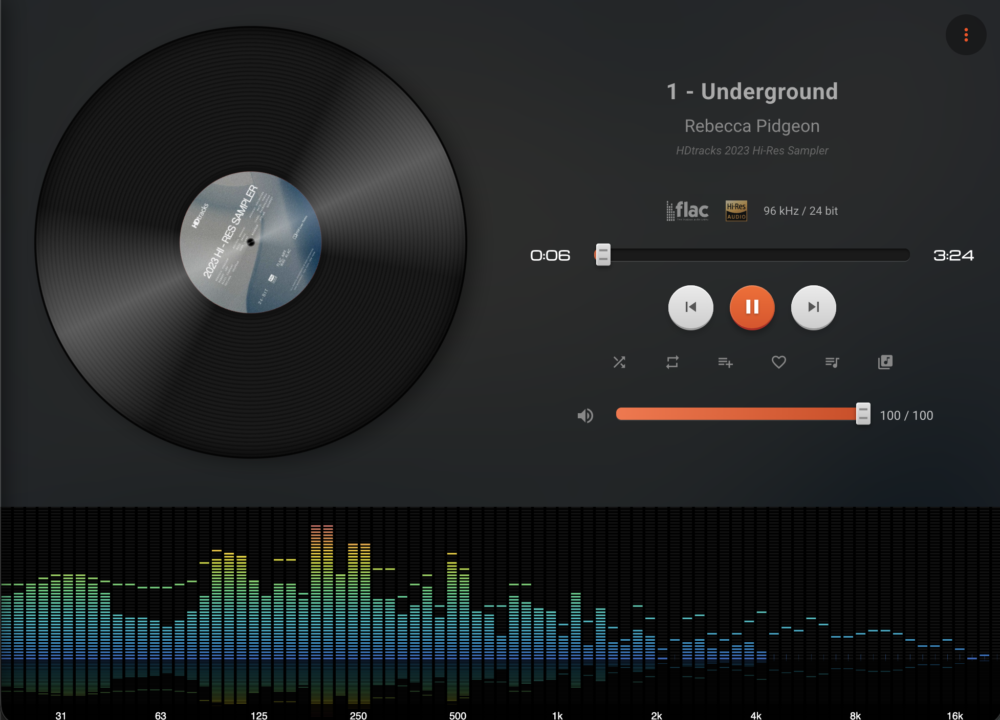

# Stylish Player Plugin

Volumio Plugin to show currently playing screen in with animated players, controls, and visualizations on the display (external or internal)

### Feature List 

[Click here for full feature list](docs/plugin-features.md)

### Screenshots

More screenshots can be found in theme pages

- [Aqua](docs/AQUA-README.md)
- [Flat](docs/FLAT-README.md)
- [Metallic](docs/METALLIC-README.md)
- [Skeuomorphic](docs/SKEUOMORPHIC-README.md)
- [Win95](docs/WIN95-README.md)

Currently requires and external device capable of loading <http://volumio.local:3339> (or a different user configurable port), which is different than the Volumio itself. For best results, use a Full HD or higher resolution screen, with touch capabilities.

### Source repository for the UI displayed by the Plugin

<https://github.com/kjavia/Volumio-UI-React/>

Above repository contains instructions on how to develop the plugin.

