## Current List of Plugin Features:

Provides a feature rich alternative "Now Playing" screen with controls, animations, spectrum analyzer, and idle screen which has it's own rich set of features.

### Now Playing screen:

1. Player animation on the left side. Multiple choices available (Double click or double tap on player to cycle through different ones below:
   1. Album Art 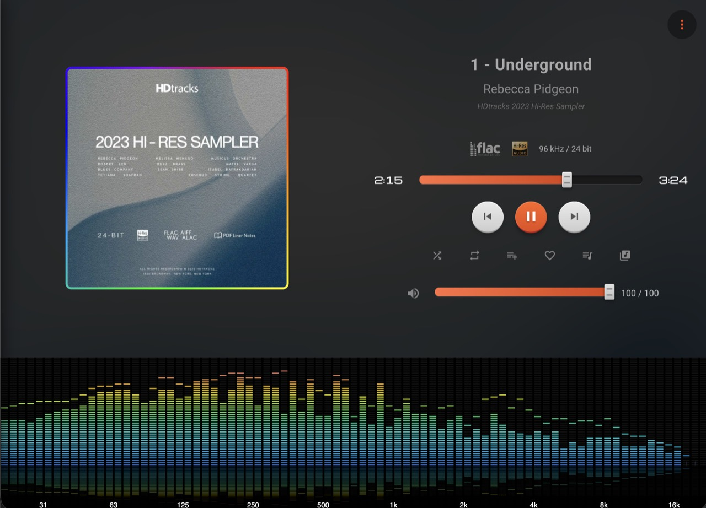
   2. Vinyl with and without cover 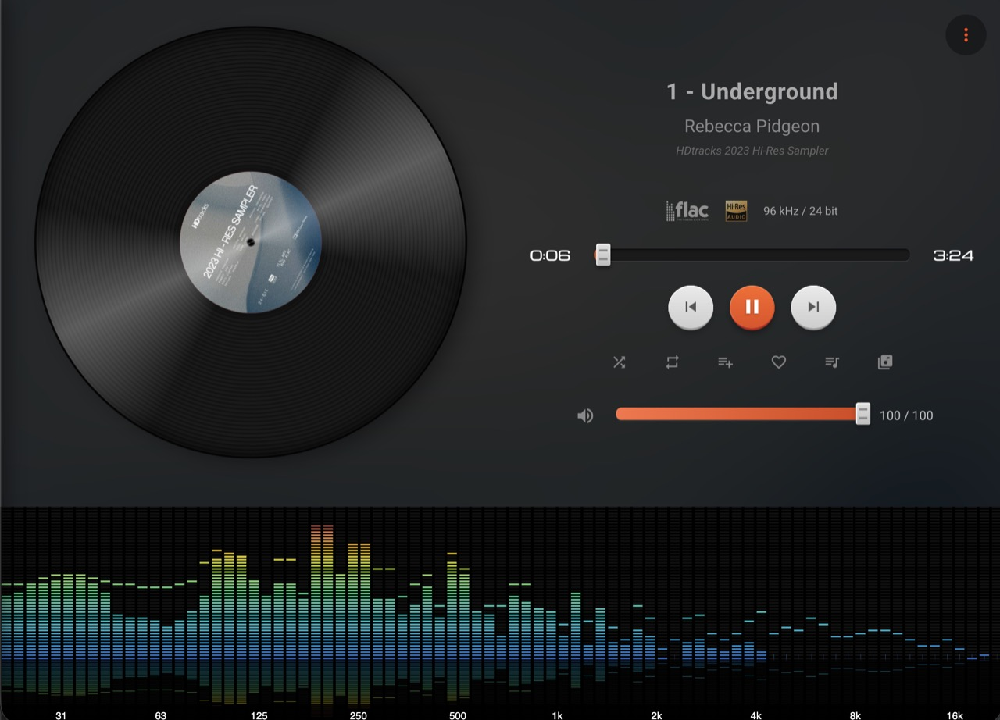
   3. CD with and without cover 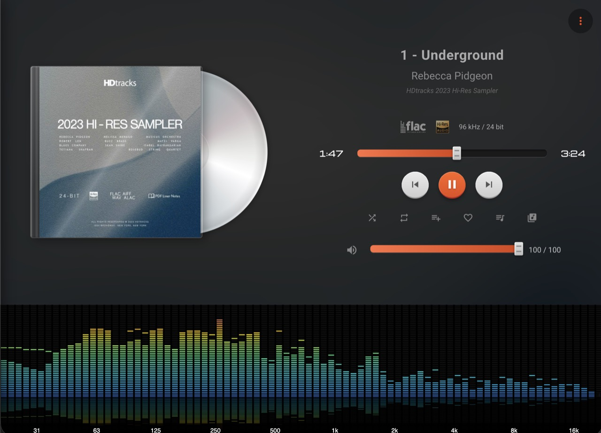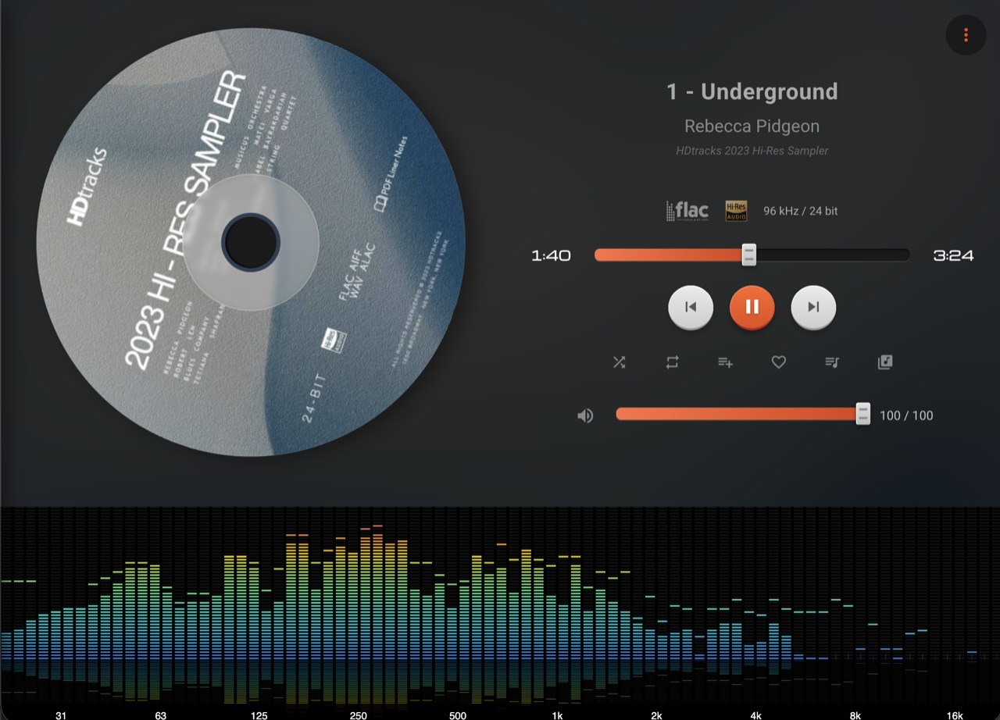
   4. Cassette 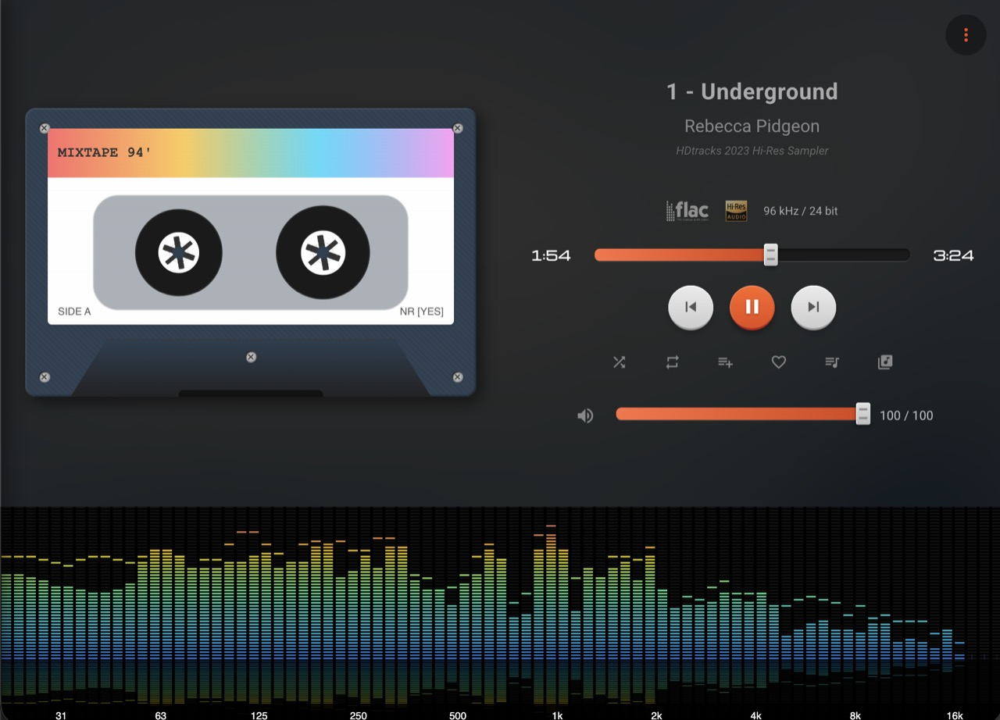
   5. Reel 2 Reel 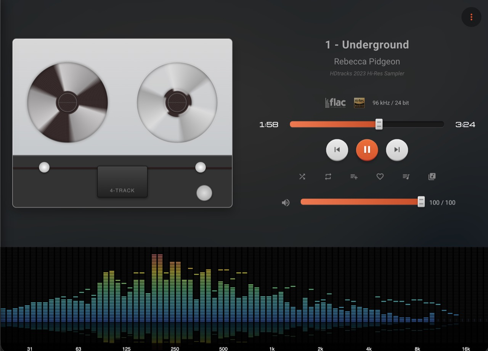
   6. Radio 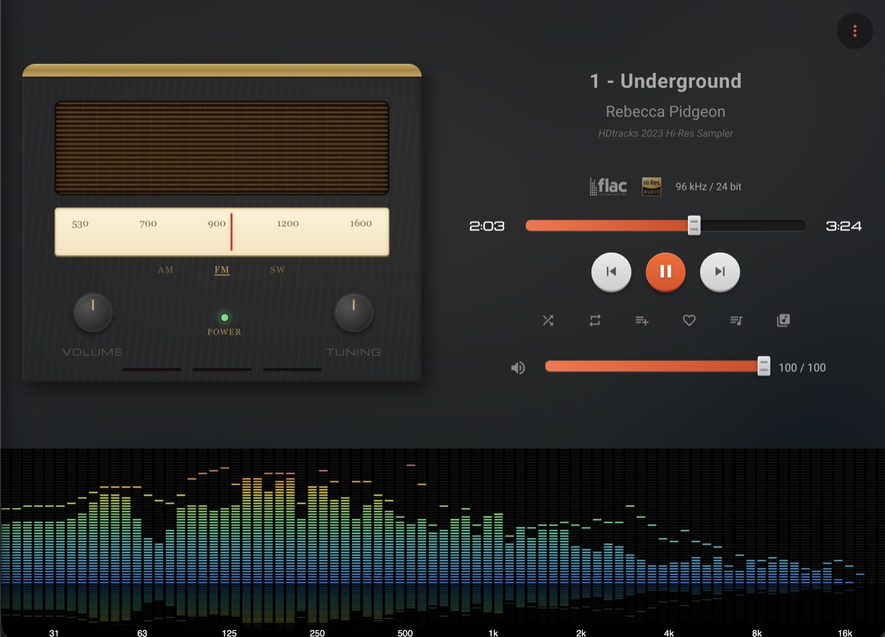
   7. Globe 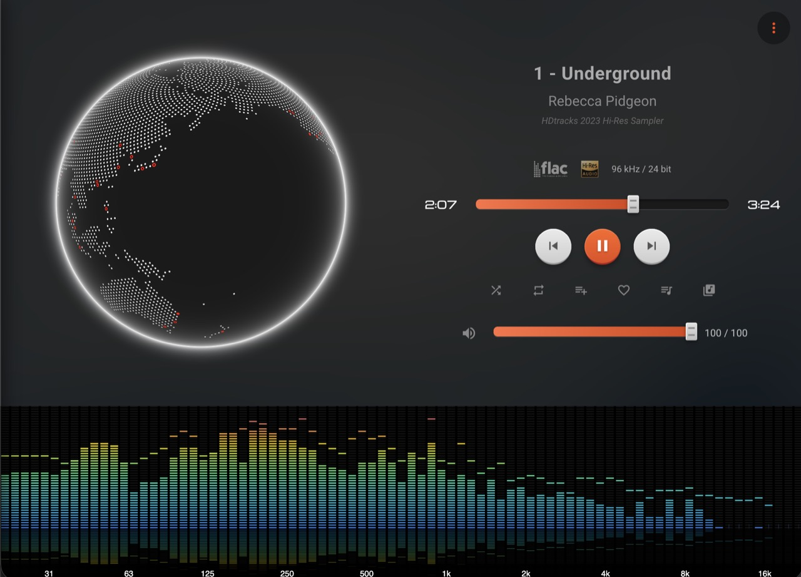
   8. Random
   9. Match source (Flac -> CD, Qobuz to Globe, Internet Radio to Radio etc.)
2. Player controls on the right, along with track and source information, and playlist management controls
3. Spectrum analyzer / VU Meters on bottom (or right depending on screen size). Provides a slightly delayed visualization based on the audio stream exposed by the device.

### Idle Screen:

When not playing music, after a desired interval, the screen falls back to a different screen with the following options.

1. Digital Clock 
2. Flip Clock 
3. Analog Clock 
4. Wallpaper (optional time and current weather) / slideshow, using Unsplash 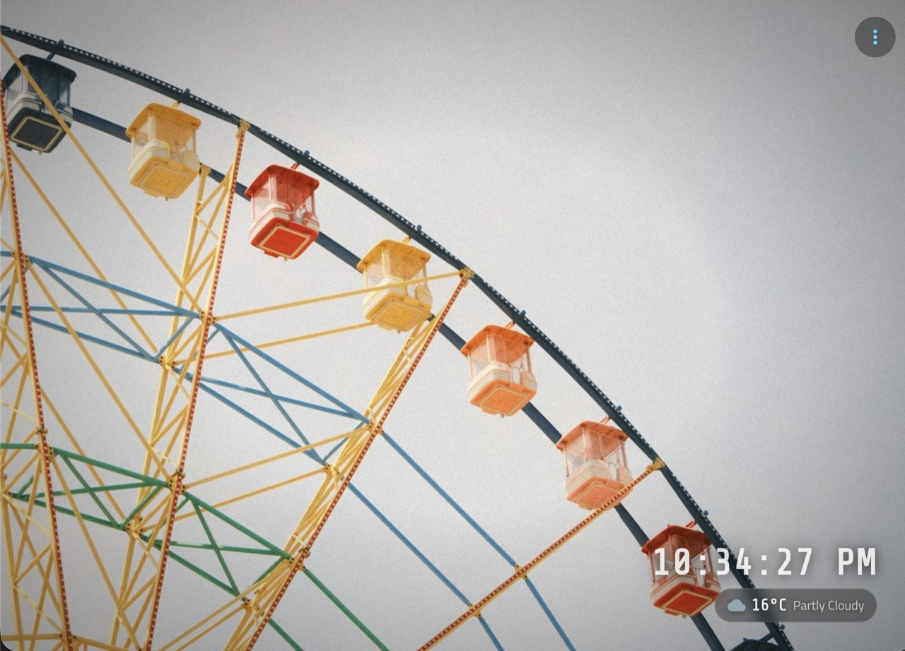
5. Weather screens (current, daily, 10 day, full details), with live weather effects (rain, fog, etc.) on the current and full weather screens 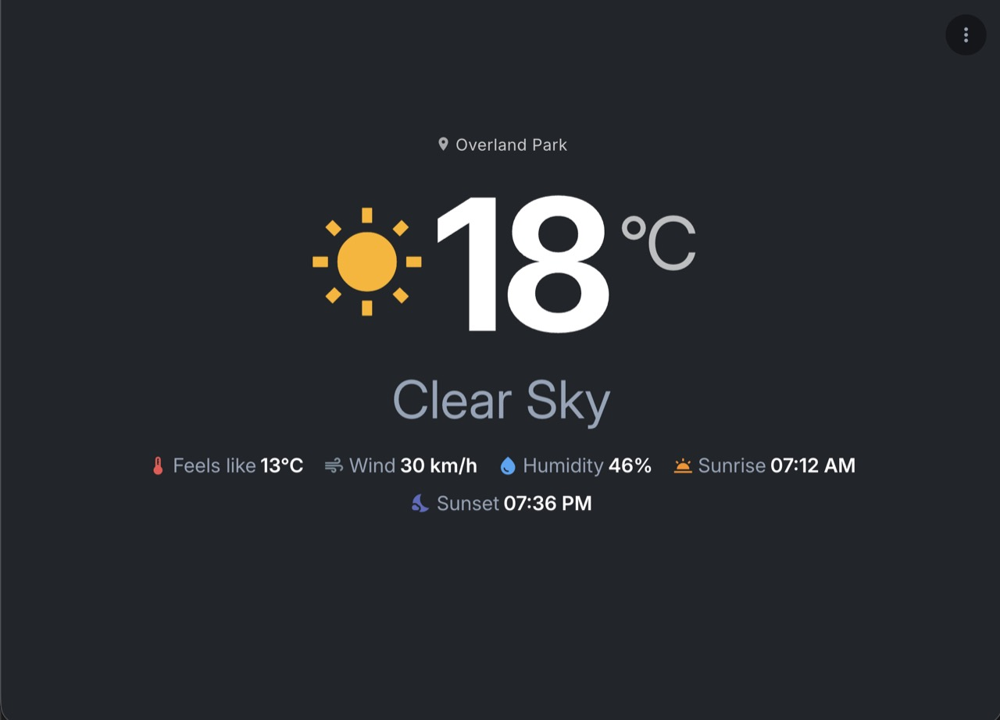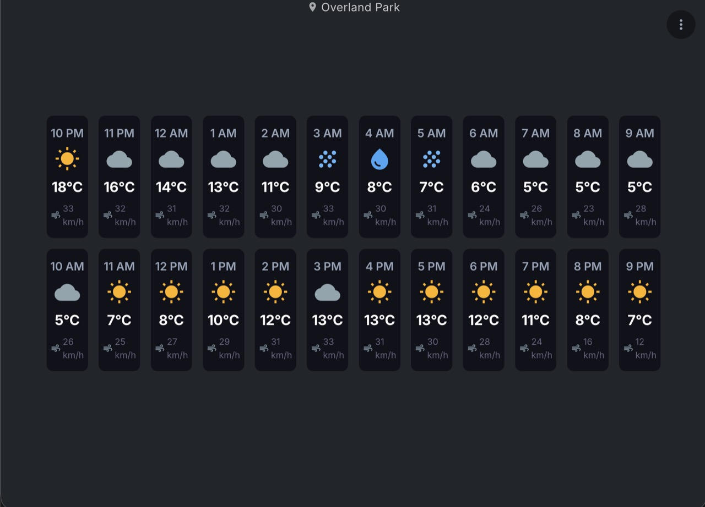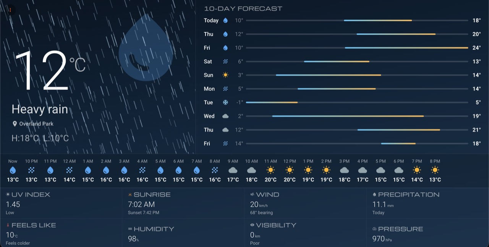

For providing photos for the Wallpaper, use Unsplash API (requires registration as a developer)

<https://unsplash.com/developers>

API Reference

<https://unsplash.com/documentation#photos>

Example Query <https://api.unsplash.com/photos/random?query=wallpaper&orientation=landscape&count=30>

#### Playlist Manager
Helps you manage your playlists in Volumio far more quickly and in bulk.
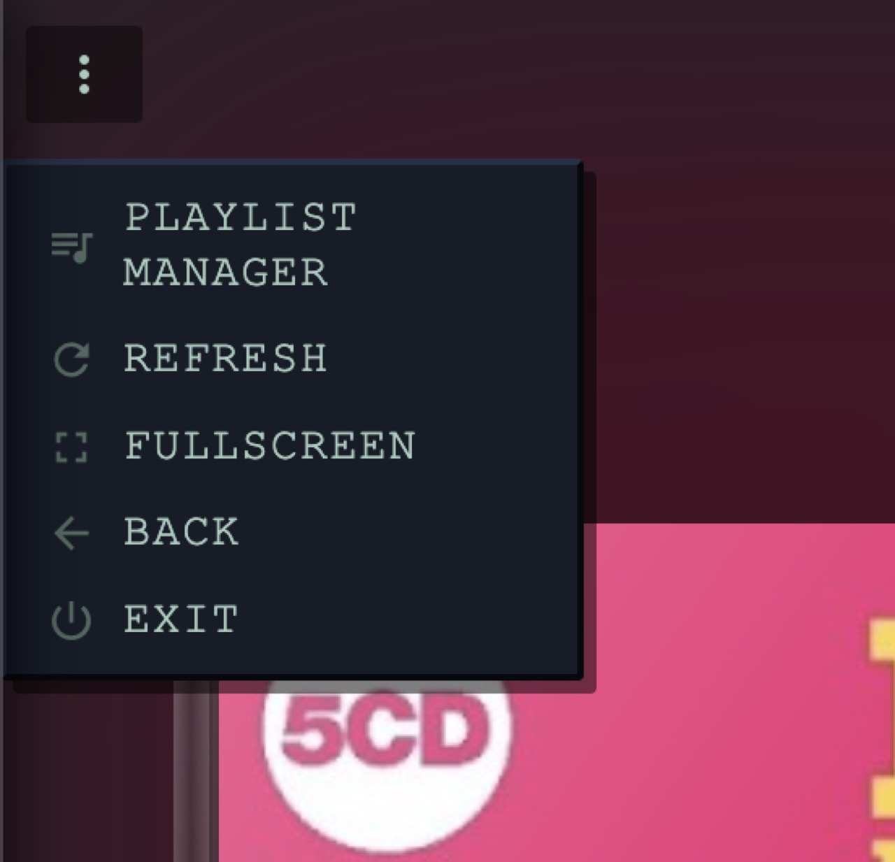
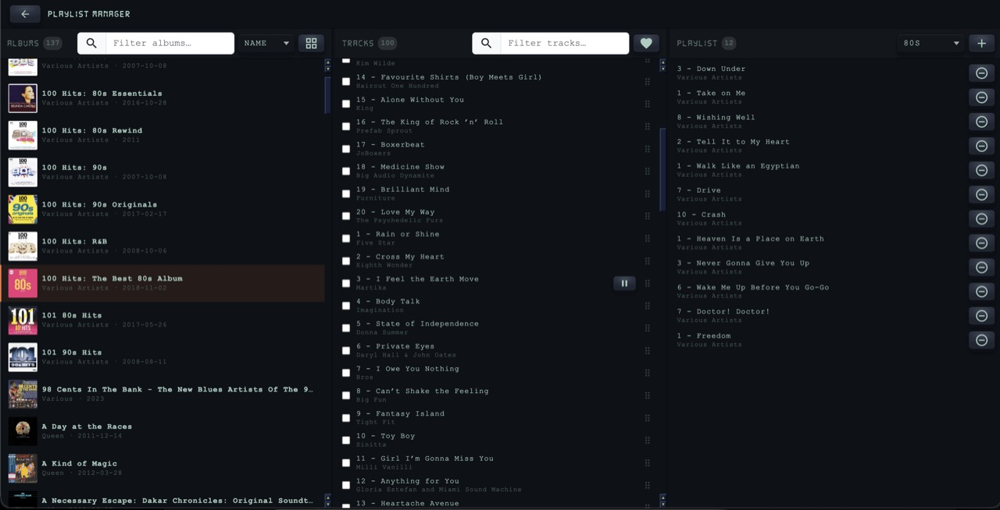

### Theming Support

Currently has 5 themes to choose from

1. Aqua [README](docs/AQUA-README.md)
2. Flat [README](docs/FLAT-README.md)
3. Metallic [README](docs/METALLIC-README.md)
4. Skeuomorphic [README](docs/SKEUOMORPHIC-README.md)
5. Win95 [README](docs/WIN95-README.md)
6. Casio 80s [README](docs/CASIO-README.md)
